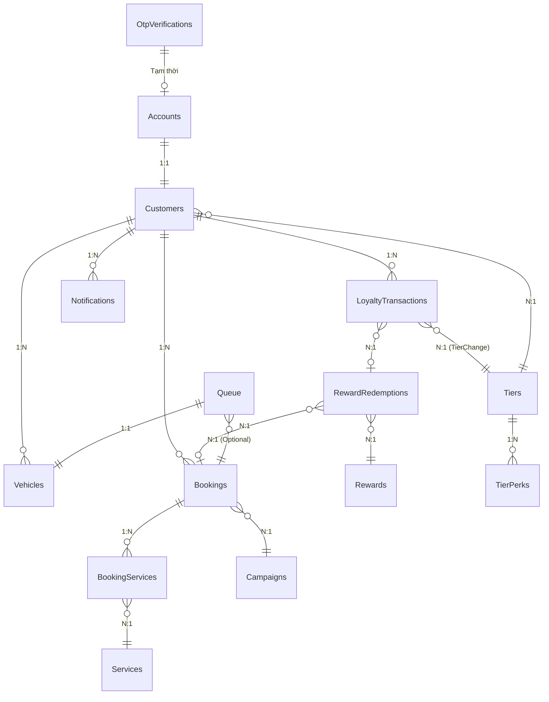

# AutoWash Pro — Database Design (16 bảng)

---

## Tổng quan sơ đồ quan hệ

### Sơ đồ dạng văn bản (ASCII Flow)
```text
Accounts ──1:1──► Customers ──1:N──► Vehicles
                      │
                      ├──1:N──► Bookings ──1:N──► BookingServices ──N:1──► Services
                      │             │
                      │             └──N:1──► Campaigns
                      │
                      ├──1:N──► LoyaltyTransactions ──N:1──► RewardRedemptions ──N:1──► Rewards
                      │             └── (TierChange) ──N:1──► Tiers
                      │
                      ├──1:N──► Notifications
                      └──N:1──► Tiers ──1:N──► TierPerks

Queue ──N:1──► Bookings
Queue ──N:1──► Vehicles

OtpVerifications  (độc lập, dùng khi đăng ký bằng SĐT)
LoyaltyConfig     (1 dòng duy nhất, admin cấu hình toàn cục)
```

### Sơ đồ quan hệ thực thể (Entity Relationship Diagram)


---

## Chi tiết từng bảng

---

### 1. Accounts

**Mục đích:** Lưu thông tin đăng nhập. Mỗi người dùng (Customer, Staff, Admin) đều có 1 Account.

**Hoạt động:**
- Khách đăng nhập Google → hệ thống nhận `GoogleId` + `Email` + `FullName` từ Google, tìm trong bảng này. Nếu chưa có → tạo mới Account + Customer.
- Admin/Staff đăng nhập bằng email + mật khẩu → dùng `PasswordHash` (bcrypt).
- `Role` quyết định khách vào trang nào: Customer → `/Customer/...`, Staff/Admin → `/Admin/...`.
- `FullName` dùng cho tất cả roles — Admin/Staff hiển thị tên trên dashboard, không cần bảng profile riêng.

**Quan hệ:**
- 1 Account → 1 Customer (nếu Role = Customer)

| Tên cột | Kiểu dữ liệu | Ràng buộc / Mặc định | Mô tả |
| :--- | :--- | :--- | :--- |
| `AccountId` | `INT` | `PK` | Khóa chính |
| `GoogleId` | `NVARCHAR(100)` | `UNIQUE NULL` | `null` nếu đăng ký bằng SĐT |
| `FullName` | `NVARCHAR(100)` | `NOT NULL` | Họ và tên (lấy từ Google profile hoặc nhập tay) |
| `Email` | `NVARCHAR(150)` | `UNIQUE NOT NULL` | Email đăng nhập |
| `Phone` | `NVARCHAR(15)` | `UNIQUE NULL` | `null` nếu đăng ký bằng Google |
| `PasswordHash` | `NVARCHAR(256)` | `NULL` | `null` nếu đăng ký bằng Google |
| `Role` | `INT` | `NOT NULL` | Vai trò: `'3-Customer' \| '2-Staff' \| '1-Admin'` |
| `IsActive` | `BIT` | `DEFAULT 1` | Trạng thái tài khoản hoạt động |
| `CreatedAt` | `DATETIME2` | `DEFAULT GETDATE()` | Thời điểm tạo tài khoản |

---

### 2. OtpVerifications

**Mục đích:** Lưu mã OTP tạm thời khi khách đăng ký bằng SĐT.

**Hoạt động:**
1. Khách nhập SĐT → hệ thống tạo mã 6 số, lưu vào bảng này, gửi SMS.
2. Khách nhập mã → hệ thống tìm bản ghi có `Phone` khớp, `IsUsed = 0`, `ExpiresAt > now`.
3. Nếu đúng → đánh dấu `IsUsed = 1` → tiếp tục tạo Account.
4. OTP hết hạn sau 5 phút. Job dọn dẹp các bản ghi cũ hàng ngày.

**Quan hệ:** Độc lập — không FK sang bảng nào, dùng xong bỏ.

| Tên cột | Kiểu dữ liệu | Ràng buộc / Mặc định | Mô tả |
| :--- | :--- | :--- | :--- |
| `OtpId` | `INT` | `PK` | Khóa chính |
| `Phone` | `NVARCHAR(15)` | `NOT NULL` | Số điện thoại nhận OTP |
| `Code` | `NVARCHAR(6)` | `NOT NULL` | Mã OTP gồm 6 chữ số |
| `ExpiresAt` | `DATETIME2` | `NOT NULL` | Thời điểm mã hết hạn |
| `IsUsed` | `BIT` | `DEFAULT 0` | Đánh dấu mã đã sử dụng |
| `CreatedAt` | `DATETIME2` | `DEFAULT GETDATE()` | Thời điểm tạo mã OTP |

---

### 3. Customers

**Mục đích:** Hồ sơ loyalty/membership của khách hàng. Là trung tâm của hầu hết mọi quan hệ. Thông tin cơ bản (tên, email, SĐT) lưu tại `Accounts`.

**Hoạt động:**
- Tạo ngay sau khi Account được tạo lần đầu (chỉ khi Role = Customer).
- `MembershipCode` sinh tự động (AW-XXXXXX), dùng để tra cứu nhanh tại quầy.
- `PointBalance` = tổng điểm **chưa hết hạn** hiện có (có thể tiêu).
- `LifetimePoints` = tổng điểm **tích lũy từ trước đến nay** (không trừ khi tiêu).
- `TierId` cập nhật mỗi tháng khi job monthly review chạy.

**Quan hệ:**
- 1 Customer → nhiều Vehicles
- 1 Customer → nhiều Bookings
- 1 Customer → nhiều LoyaltyTransactions
- 1 Customer → nhiều Notifications
- 1 Customer → 1 Tier (tier hiện tại)

| Tên cột | Kiểu dữ liệu | Ràng buộc / Mặc định | Mô tả |
| :--- | :--- | :--- | :--- |
| `CustomerId` | `INT` | `PK` | Khóa chính |
| `AccountId` | `INT` | `FK → Accounts` | Liên kết tới tài khoản đăng nhập |
| `MembershipCode` | `NVARCHAR(20)` | `UNIQUE NOT NULL` | Mã thành viên độc nhất (AW-XXXXXX) |
| `TierId` | `INT` | `FK → Tiers` | Cấp bậc / Hạng thành viên hiện tại |
| `PointBalance` | `INT` | `DEFAULT 0` | Điểm hiện có để tiêu / đổi thưởng |
| `RankingBalance` | `INT` | `DEFAULT 0` | Tổng tiền tích lũy sếp hạng / 2 năm |
| `LifetimePoints` | `INT` | `DEFAULT 0` | Tổng điểm tích lũy trọn đời |
| `TotalVisits` | `INT` | `DEFAULT 0` | Tổng số lần ghé tiệm sử dụng dịch vụ |
| `TotalSpend` | `INT` | `DEFAULT 0` | Tổng số tiền đã chi tiêu tại hệ thống |
| `JoinedAt` | `DATETIME2` | `DEFAULT GETDATE()` | Ngày tham gia hệ thống |
| `LastVisitAt` | `DATETIME2` | `NULL` | Lần ghé thăm / rửa xe gần nhất |

---

### 4. Vehicles

**Mục đích:** Lưu xe của khách. Dùng để LPR tra cứu và pre-fill khi đặt lịch.

**Hoạt động:**
- Khách thêm xe từ Profile → nhập biển số, loại xe.
- Khi xe vào cổng, LPR đọc biển số → tìm trong bảng này → lấy `CustomerId` → biết khách là ai.
- `IsDefault = 1` → xe hiển thị sẵn khi mở trang Booking.

**Quan hệ:**
- 1 Customer → nhiều Vehicles
- 1 Vehicle → nhiều Bookings
- 1 Vehicle → nhiều Queue entries

| Tên cột | Kiểu dữ liệu | Ràng buộc / Mặc định | Mô tả |
| :--- | :--- | :--- | :--- |
| `VehicleId` | `INT` | `PK` | Khóa chính |
| `CustomerId` | `INT` | `FK → Customers` | Chủ sở hữu xe |
| `LicensePlate` | `NVARCHAR(20)` | `NOT NULL` | Biển số xe (Có INDEX để LPR tra quét nhanh) |
| `Brand` | `NVARCHAR(50)` | `NULL` | Hãng sản xuất xe (Toyota, Honda...) |
| `Name` | `NVARCHAR(50)` | `NULL` | Dòng xe (Vision, SH...) |
| `RegisteredAt` | `DATETIME2` | `DEFAULT GETDATE()` | Ngày xe được thêm vào hệ thống |

*Ràng buộc đặc biệt:* `UNIQUE(CustomerId, LicensePlate)` - Mỗi khách hàng không thể thêm trùng biển số xe.

---

### 5. Tiers

**Mục đích:** Cấu hình 4 hạng thành viên và quyền lợi cơ bản đi kèm.

**Hoạt động:**
- `MinRankingBalance` → ngưỡng để đạt tier. Monthly review so sánh `Customer.LifetimePoints` với cột này.
- `BookingWindowDays` → khách được đặt trước tối đa bao nhiêu ngày. VD: Member chỉ đặt được trong 7 ngày tới, Platinum được 14 ngày.
- `QueuePriority` → số càng cao càng ưu tiên vào queue trước. Platinum (4) > Gold (3) > Silver (2) > Member (1).
- `PointMultiplier` → nhân hệ số khi tính điểm. Gold × 1.5 nghĩa là rửa xe 100.000đ → 150 điểm thay vì 100.
- `DiscountPercent` → % giảm giá auto-apply lên `FinalPrice` mỗi booking.

**Quan hệ:**
- 1 Tier → nhiều Customers
- 1 Tier → nhiều TierPerks
- 1 Tier → nhiều LoyaltyTransactions (TierChange)

| Tên cột | Kiểu dữ liệu | Ràng buộc / Mặc định | Mô tả |
| :--- | :--- | :--- | :--- |
| `TierId` | `INT` | `PK` | Khóa chính |
| `TierName` | `NVARCHAR(20)` | `NOT NULL` | Tên hạng thành viên: `'Member' \| 'Silver' \| 'Gold' \| 'Platinum'` |
| `MinRankingBalance` | `INT` | `NOT NULL` | Ngưỡng điểm tích lũy trọn đời tối thiểu để đạt hạng |
| `BookingWindowDays` | `INT` | `NOT NULL` | Số ngày tối đa được đặt trước lịch |
| `QueuePriority` | `INT` | `NOT NULL` | Độ ưu tiên xếp hàng (Số cao hơn ưu tiên rửa trước) |
| `PointMultiplier` | `DECIMAL(4,2)` | `DEFAULT 1.0` | Hệ số nhân điểm tích lũy |
| `DiscountPercent` | `DECIMAL(5,2)` | `DEFAULT 0` | Tỷ lệ % giảm giá tự động áp dụng |
| `BadgeColor` | `INT` | `NULL` | Màu của huy hiệu hạng |
| `SortOrder` | `INT` | `NOT NULL` | Thứ tự sắp xếp thứ hạng |

**Dữ liệu mẫu:**

| TierName | MinRankingBalance | BookingWindow | QueuePriority | PointMultiplier | DiscountPercent |
| :--- | :--- | :--- | :--- | :--- | :--- |
| Member | 0 | 7 ngày | 1 | ×1.0 | 0% |
| Silver | 500 | 10 ngày | 2 | ×1.2 | 5% |
| Gold | 2000 | 12 ngày | 3 | ×1.5 | 10% |
| Platinum | 5000 | 14 ngày | 4 | ×2.0 | 15% |

---

### 6. TierPerks

**Mục đích:** Quyền lợi mở rộng theo từng tier — những thứ không thể lưu bằng 1 con số đơn giản trong `Tiers`. Admin cấu hình từ portal, không cần sửa code.

**Hoạt động:**
- Khi khách checkout, hệ thống lấy tất cả TierPerks có `TierId = customer.TierId` và `IsActive = 1`.
- Với mỗi perk, áp dụng logic tương ứng:
  - `Free_AddOn` → tìm `ServiceId` trong booking, nếu có → set giá = 0.
  - `Bonus_Points_Flat` → cộng thêm điểm cố định vào `PointsEarned`.
  - `Discount_Percent` → trường hợp muốn giảm giá riêng cho từng loại dịch vụ (khác `Tiers.DiscountPercent` là giảm toàn bộ).

**Quan hệ:**
- 1 Tier → nhiều TierPerks
- TierPerks có thể tham chiếu ServiceId (free add-on cụ thể)

| Tên cột | Kiểu dữ liệu | Ràng buộc / Mặc định | Mô tả |
| :--- | :--- | :--- | :--- |
| `PerkId` | `INT` | `PK` | Khóa chính |
| `TierId` | `INT` | `FK → Tiers` | Liên kết tới bảng `Tiers` |
| `PerkType` | `NVARCHAR(30)` | `NOT NULL` | Loại đặc quyền:<br>- `'Free_AddOn'`: Tặng free 1 add-on cụ thể mỗi lần rửa<br>- `'Bonus_Points_Flat'`: Cộng thêm số điểm cố định<br>- `'Discount_Percent'`: Giảm thêm % cho loại dịch vụ cụ thể |
| `PerkValue` | `DECIMAL(10,2)` | `NOT NULL` | Giá trị đặc quyền (Số điểm, %, hoặc `ServiceId` tương ứng) |
| `ServiceId` | `INT` | `FK → Services NULL` | Dịch vụ được tặng kèm (nếu loại là `Free_AddOn`) |
| `Description` | `NVARCHAR(200)` | `NOT NULL` | Mô tả đặc quyền chi tiết |
| `IsActive` | `BIT` | `DEFAULT 1` | Trạng thái hiệu lực |

**Ví dụ dữ liệu:**

| TierName | PerkType | PerkValue | ServiceId | Description |
| :--- | :--- | :--- | :--- | :--- |
| Gold | Free_AddOn | 0 | 5 (Nano coating) | Free nano mỗi lần rửa |
| Gold | Bonus_Points_Flat | 50 | null | +50 điểm mỗi lần rửa |
| Platinum | Free_AddOn | 0 | 3 (Làm thơm) | Free làm thơm |
| Platinum | Free_AddOn | 0 | 7 (Đánh bóng) | Free đánh bóng la-zăng |
| Platinum | Bonus_Points_Flat | 100 | null | +100 điểm mỗi lần rửa |

---

### 7. LoyaltyConfig

**Mục đích:** Cấu hình toàn cục cho loyalty engine. Chỉ có **1 dòng duy nhất**. Admin chỉnh từ Dashboard.

**Hoạt động:**
- `PointsPerThousandVND` → cứ 1.000đ thanh toán = X điểm (trước khi nhân tier multiplier).
- `PointExpiryMonths` → điểm kiếm ngày nào sẽ hết hạn sau N tháng. Mặc định 12.
- `TierReviewDayOfMonth` → ngày mấy trong tháng hệ thống tự động chạy monthly tier review. Mặc định ngày 1.


| Tên cột | Kiểu dữ liệu | Ràng buộc / Mặc định | Mô tả |
| :--- | :--- | :--- | :--- |
| `ConfigId` | `INT` | `PK DEFAULT 1` | Khóa chính lưu cấu hình độc nhất |
| `PointsPerThousandVND` | `INT` | `DEFAULT 1` | Tỷ lệ đổi điểm tích lũy (1 = 1.000đ nhận 1 điểm cơ sở) |
| `PointExpiryMonths` | `INT` | `DEFAULT 12` | Số tháng điểm có hiệu lực trước khi hết hạn |
| `TierReviewDayOfMonth` | `INT` | `DEFAULT 1` | Ngày tự động chạy job xét lại hạng thành viên trong tháng |
| `RankingWindowYears` | `INT` | `DEFAULT 2` | cửa sổ trượt 2 năm |
| `UpdatedAt` | `DATETIME2` | `NULL` | Ngày cập nhật cấu hình |
| `UpdatedBy` | `INT` | `FK → Accounts NULL` | Quản trị viên cập nhật |

---

### 8. LoyaltyTransactions

**Mục đích:** Ghi lại **mọi biến động điểm** của khách. Là bảng quan trọng nhất của loyalty engine. Ngoài ra kiêm luôn lưu lịch sử tier change và redemption.

**Hoạt động theo từng Type:**

**`Earned`** — Kiếm điểm sau rửa xe
- Tạo khi Booking chuyển sang `Completed`.
- `Points` = `FinalPrice / 1000 × PointsPerThousandVND × Tiers.PointMultiplier × Campaign.BonusMultiplier`.
- `ExpiryDate` = ngày tạo + `LoyaltyConfig.PointExpiryMonths`.
- Cộng vào `Customer.PointBalance` và `Customer.LifetimePoints`.

**`Redeemed`** — Tiêu điểm đổi reward
- Tạo khi khách đổi reward từ trang Loyalty.
- `Points` = số âm (VD: -500).
- `RedemptionId` trỏ đến voucher vừa tạo trong `RewardRedemptions`.
- Trừ `Customer.PointBalance`.

**`Expired`** — Điểm hết hạn
- Job chạy hàng ngày, tìm các giao dịch `Earned` có `ExpiryDate <= today` và `IsExpired = 0`.
- Tạo giao dịch `Expired` với `Points` âm tương ứng.
- Trừ `Customer.PointBalance`. Không trừ `LifetimePoints`.

**`Adjusted`** — Admin điều chỉnh tay
- Admin vào trang Customers → cộng/trừ điểm thủ công.
- `Note` ghi lý do.

**`Bonus`** — Điểm thưởng từ campaign
- Tạo khi campaign có `BonusPointMultiplier` đang active.
- Ghi riêng để tách bạch với điểm thường.

**`TierChange`** — Nâng/hạ tier
- Tạo khi monthly review job chạy và phát hiện tier thay đổi.
- `FromTierId` → `ToTierId` ghi lại lịch sử.
- `Points = 0` (không ảnh hưởng điểm, chỉ để audit).

**Quan hệ:**
- 1 Customer → nhiều LoyaltyTransactions
- Tham chiếu RewardRedemptions (khi Redeemed), Tiers (khi TierChange), Bookings (khi Earned)

| Tên cột | Kiểu dữ liệu | Ràng buộc / Mặc định | Mô tả |
| :--- | :--- | :--- | :--- |
| `TransactionId` | `INT` | `PK` | Khóa chính |
| `CustomerId` | `INT` | `FK → Customers` | Chủ sở hữu điểm giao dịch |
| `Points` | `INT` | `NOT NULL` | Số điểm biến động (+ cộng điểm, - trừ điểm/tiêu điểm) |
| `TransactionType` | `NVARCHAR(20)` | `NOT NULL` | Loại: `'Earned' \| 'Redeemed' \| 'Expired' \| 'Adjusted' \| 'Bonus' \| 'TierChange'` |
| `BookingId` | `INT` | `FK → Bookings NULL` | Lịch đặt liên quan (khi `Earned`) |
| `RedemptionId` | `INT` | `FK → RewardRedemptions NULL` | Voucher liên quan (khi `Redeemed`) |
| `ExpiryDate` | `DATE` | `NULL` | Hạn hết điểm (chỉ khi `Earned`) |
| `IsExpired` | `BIT` | `DEFAULT 0` | Đánh dấu điểm đã hết hạn hay chưa |
| `FromTierId` | `INT` | `FK → Tiers NULL` | Hạng cũ (chỉ khi `TierChange`) |
| `ToTierId` | `INT` | `FK → Tiers NULL` | Hạng mới (chỉ khi `TierChange`) |
| `Note` | `NVARCHAR(300)` | `NULL` | Ghi chú lý do biến động điểm |
| `CreatedAt` | `DATETIME2` | `DEFAULT GETDATE()` | Thời điểm giao dịch |

---

### 9. Services

**Mục đích:** Danh mục tất cả dịch vụ — cả gói rửa chính lẫn add-on, phân biệt bằng `IsAddOn`.

**Hoạt động:**
- Admin CRUD từ trang Services.
- `IsAddOn = 0` → dịch vụ chính (Basic/Premium/Deluxe), khách chọn 1 gói.
- `IsAddOn = 1` → add-on (nano, làm thơm, đánh bóng...), khách chọn nhiều.
- `IsFeatured = 1` → hiển thị nổi bật trên trang Booking.
- Giá lưu trong bảng này là giá **hiện tại**. Giá tại thời điểm đặt lịch lưu riêng trong `BookingServices.PriceSnapshot`.

**Quan hệ:**
- 1 Service → nhiều BookingServices
- 1 Service ← TierPerks (free add-on)
- 1 Service ← Rewards (free wash/add-on reward)

| Tên cột | Kiểu dữ liệu | Ràng buộc / Mặc định | Mô tả |
| :--- | :--- | :--- | :--- |
| `ServiceId` | `INT` | `PK` | Khóa chính |
| `ServiceName` | `NVARCHAR(100)` | `NOT NULL` | Tên dịch vụ |
| `Description` | `NVARCHAR(500)` | `NULL` | Mô tả chi tiết dịch vụ |
| `Category` | `INT` | `NOT NULL` |  |
| `BasePrice` | `INT` | `NOT NULL` | Giá niêm yết hiện tại |
| `EstimatedMinutes` | `INT` | `NOT NULL` | Thời gian ước tính thực hiện (phút) |
| `IsAddOn` | `BIT` | `DEFAULT 0` | Có là dịch vụ phụ đính kèm không |
| `IsActive` | `BIT` | `DEFAULT 1` | Trạng thái hoạt động |
| `IsFeatured` | `BIT` | `DEFAULT 0` | Hiển thị nổi bật ngoài trang chủ |


---

### 10. Bookings

**Mục đích:** Đơn đặt lịch. Lưu snapshot toàn bộ giá tại thời điểm đặt + thông tin thanh toán + đánh giá.

**Hoạt động — vòng đời 1 booking:**

```text
Pending ──► Confirmed ──► InProgress ──► Completed
                 │                              │
                 └──► Cancelled             (Ratings, Payment lưu vào đây)
```

1. Khách đặt lịch → tạo Booking với `Status = Pending`.
2. Staff xác nhận → `Status = Confirmed`.
3. Xe vào Queue → `Status = InProgress`.
4. Hoàn thành → `Status = Completed` → tự động tạo `LoyaltyTransaction (Earned)` + `Notification`.
5. Khách đánh giá → cập nhật các cột `Stars`, `ReviewText`, `RatingTags`.
6. Staff thu tiền → cập nhật các cột `PaymentMethod`, `CashAmount`, `PaidAt`.

**Tính giá:**
```text
FinalPrice = BasePrice
           - TierDiscount    (Tiers.DiscountPercent × BasePrice)
           - PromoDiscount   (từ Campaigns)
           - PointsDiscount  (điểm dùng để trừ tiền)
```

**Quan hệ:**
- 1 Booking → nhiều BookingServices
- 1 Booking → 1 Queue entry
- 1 Booking → nhiều LoyaltyTransactions

| Tên cột | Kiểu dữ liệu | Ràng buộc / Mặc định | Mô tả |
| :--- | :--- | :--- | :--- |
| `BookingId` | `INT` | `PK` | Khóa chính |
| `CustomerId` | `INT` | `FK → Customers` | Khách hàng đặt lịch |
| `VehicleId` | `INT` | `FK → Vehicles` | Xe rửa của khách |
| `ScheduledAt` | `DATETIME` | `NOT NULL` | Thời gian đặt lịch rửa xe |
| `Status` | `INT` | `DEFAULT 1 ` | default 1|
| `BasePrice` | `INT` | `NOT NULL` | Tổng tiền ban đầu (tiền gốc) |
| `TierDiscount` | `INT` | `DEFAULT 0` | Tiền giảm giá theo hạng thành viên |
| `PromoDiscount` | `INT` | `DEFAULT 0` | Tiền giảm giá từ khuyến mại |
| `PointsDiscount` | `INT` | `DEFAULT 0` | Tiền giảm giá quy đổi từ điểm tích lũy |
| `FinalPrice` | `INT` | `NOT NULL` | Số tiền thanh toán cuối cùng |
| `PointsEarned` | `INT` | `DEFAULT 0` | Số điểm tích lũy được thưởng |
| `PointsRedeemed` | `INT` | `DEFAULT 0` | Số điểm tích lũy tiêu hao để trừ tiền |
| `PromoCodeId` | `INT` | `FK → Campaigns NULL` | Chiến dịch khuyến mại được áp dụng |
| `RedemptionId` | `INT` | `FK → RewardRedemptions NULL` | Voucher reward đang áp dụng |
| `Notes` | `NVARCHAR(500)` | `NULL` | Ghi chú của khách |
| `CreatedAt` | `DATETIME2` | `DEFAULT GETDATE()` | Ngày đặt lịch |

| **Thanh toán (Payment)** | | | *(Có thể NULL, điền khi thanh toán)* |
| `PaymentMethod` | `NVARCHAR(20)` | `DEFAULT CASH` | Hình thức thanh toán: `'Cash' \| 'Points' \| 'Mixed'` |
| `CashAmount` | `INT` | `NULL` | Số tiền mặt/chuyển khoản đã trả |
| `PointsUsed` | `INT` | `NULL` | Số điểm đã sử dụng để thanh toán |
| `PointsValueVND` | `INT` | `NULL` | Giá trị tiền VNĐ quy đổi của số điểm đã dùng |
| `PaidAt` | `DATETIME2` | `NULL` | Thời điểm thanh toán thành công |

| **Đánh giá (Rating)** | | | *(Có thể NULL, điền sau khi hoàn thành)* |
| `Stars` | `TINYINT` | `NULL` | Số sao đánh giá từ 1 - 5 |
| `ReviewText` | `NVARCHAR(1000)` | `NULL` | Nhận xét phản hồi |
| `RatingTags` | `NVARCHAR(200)` | `NULL` | Thẻ đánh giá lưu JSON: `["sạch","nhanh","thân thiện"]` |
| `RatingBonusPoints` | `INT` | `NULL` | Điểm bonus thêm sau khi viết review |

---

### 11. BookingServices

**Mục đích:** Bảng trung gian cho quan hệ nhiều-nhiều giữa Booking và Services.

**Tại sao cần bảng này:**
- 1 booking có thể chọn **nhiều dịch vụ** (1 gói chính + nhiều add-on).
- 1 dịch vụ có thể nằm trong **nhiều booking** khác nhau.
- `PriceSnapshot` lưu giá **tại thời điểm đặt** — đảm bảo dù admin sau này đổi giá dịch vụ thì booking cũ không bị ảnh hưởng.

**Ví dụ:**
```text
BookingId=101:
  ServiceId=1 (Rửa Premium)    PriceSnapshot=150.000đ
  ServiceId=5 (Nano coating)   PriceSnapshot=50.000đ   ← add-on
  ServiceId=3 (Làm thơm)       PriceSnapshot=30.000đ   ← add-on
  BasePrice tổng = 230.000đ
```

| Tên cột | Kiểu dữ liệu | Ràng buộc / Mặc định | Mô tả |
| :--- | :--- | :--- | :--- |
| `BookingServiceId` | `INT` | `PK` | Khóa chính |
| `BookingId` | `INT` | `FK → Bookings` | Liên kết tới bảng `Bookings` |
| `ServiceId` | `INT` | `FK → Services` | Liên kết tới bảng `Services` |
| `PriceSnapshot` | `INT` | `NOT NULL` | Giá dịch vụ được ghi nhận tại thời điểm đặt hàng |

---

### 12. Queue

**Mục đích:** Quản lý hàng đợi xe tại tiệm theo thời gian thực.

**Hoạt động:**
- **Khách có booking:** xe vào cổng, LPR đọc biển số → tìm `Vehicles` → lấy `BookingId` đang `Confirmed` hôm nay → tự động tạo Queue entry.
- **Walk-in:** Staff tạo thủ công, không cần `BookingId`.
- Sắp xếp theo `TierId` (Platinum lên trước) rồi theo `CheckInAt`.
- Cập nhật `Status` theo từng bước rửa xe: `Waiting → LPR_Scan → Washing → Drying → Completed`.
- Khi `Completed` → trigger cập nhật Booking + tạo LoyaltyTransaction.

**Quan hệ:**
- 1 Queue → 1 Booking (nullable, walk-in thì null)
- 1 Queue → 1 Vehicle

| Tên cột | Kiểu dữ liệu | Ràng buộc / Mặc định | Mô tả |
| :--- | :--- | :--- | :--- |
| `QueueId` | `INT` | `PK` | Khóa chính |
| `BookingId` | `INT` | `FK → Bookings NULL` | Lịch đặt (walk-in thì bằng `null`) |
| `VehicleId` | `INT` | `FK → Vehicles NULL` | Liên kết tới phương tiện |
| `CustomerId` | `INT` | `FK → Customers NULL` | Liên kết tới hồ sơ khách hàng |
| `LicensePlate` | `NVARCHAR(20)` | `NOT NULL` | Biển số xe quét qua LPR |
| `CustomerName` | `NVARCHAR(100)` | `NULL` | Tên khách hàng |
| `TierId` | `INT` | `FK → Tiers NULL` | Hạng thành viên (áp dụng để tính mức ưu tiên) |
| `Status` | `NVARCHAR(30)` | `DEFAULT 'Waiting'` | Trạng thái: `'Waiting' \| 'LPR_Scan' \| 'Washing' \| 'Drying' \| 'Completed' \| 'Cancelled'` |
| `Position` | `INT` | `NOT NULL` | Vị trí xếp hàng hiện tại |
| `CheckInAt` | `DATETIME2` | `DEFAULT GETDATE()` | Giờ xe vào tiệm check-in |
| `StartedAt` | `DATETIME2` | `NULL` | Giờ bắt đầu tiến hành rửa xe |
| `CompletedAt` | `DATETIME2` | `NULL` | Giờ rửa xong và rời tiệm |
| `StaffNote` | `NVARCHAR(300)` | `NULL` | Ghi chú của nhân viên rửa xe |

---

### 13. Rewards

**Mục đích:** Danh mục phần thưởng khách có thể đổi bằng điểm.

**Hoạt động:**
- Admin tạo reward từ Admin Portal.
- `MinTierId` → chỉ tier đó trở lên mới thấy và đổi được. VD: free wash chỉ cho Gold+.
- `StockLimit` → null = vô hạn. Nếu có số → `RedeemedCount >= StockLimit` thì ẩn/disable.
- Khách đổi → tạo `LoyaltyTransaction (Redeemed)` với `RewardId` trỏ vào đây.
- `RewardType` quyết định logic áp dụng khi dùng:
  - `Discount_Percent` / `Discount_Fixed` → trừ vào `Bookings.PromoDiscount`.
  - `Free_Wash` → set `BookingServices.PriceSnapshot = 0` cho dịch vụ chính.
  - `Free_AddOn` → set `BookingServices.PriceSnapshot = 0` cho add-on chỉ định.

**Quan hệ:**
- 1 Reward ← nhiều RewardRedemptions

| Tên cột | Kiểu dữ liệu | Ràng buộc / Mặc định | Mô tả |
| :--- | :--- | :--- | :--- |
| `RewardId` | `INT` | `PK` | Khóa chính |
| `RewardName` | `NVARCHAR(100)` | `NOT NULL` | Tên quà tặng |
| `Description` | `NVARCHAR(300)` | `NULL` | Mô tả quà tặng |
| `PointCost` | `INT` | `NOT NULL` | Số điểm cần đổi |
| `RewardType` | `NVARCHAR(30)` | `NOT NULL` | Loại: `'Discount_Percent' \| 'Discount_Fixed' \| 'Free_Wash' \| 'Free_AddOn'` |
| `DiscountValue` | `DECIMAL(10,2)` | `NULL` | Giá trị giảm giá tương ứng (% hoặc số tiền cụ thể) |
| `ServiceId` | `INT` | `FK → Services NULL` | Dịch vụ được tặng kèm miễn phí |
| `MinTierId` | `INT` | `FK → Tiers NULL` | Hạng tối thiểu được quyền đổi quà này |
| `ValidDays` | `INT` | `DEFAULT 30` | Thời hạn sử dụng quà tặng (ngày) |
| `StockLimit` | `INT` | `NULL` | Số lượng giới hạn còn lại trong kho (`null` = không hạn chế) |
| `RedeemedCount` | `INT` | `DEFAULT 0` | Số lượng đã được đổi thực tế |
| `IsActive` | `BIT` | `DEFAULT 1` | Trạng thái hoạt động |

---

### 14. Campaigns

**Mục đích:** Chiến dịch khuyến mãi có target theo tier. Tích hợp luôn promo code.

**Hoạt động:**
- Admin tạo campaign, chọn `TargetTierMinId` → chỉ khách từ tier đó trở lên mới thấy campaign và dùng được code.
- `BonusPointMultiplier` → trong thời gian campaign, điểm kiếm được nhân thêm. VD: 1.5 = x1.5 điểm.
- `PromoCode` → khách nhập vào ô promo khi booking → hệ thống check `StartDate ≤ today ≤ EndDate`, `Status = Active`, `UsedCount < UsageLimit`, tier khách ≥ `TargetTierMinId`.
- Nếu hợp lệ → tính `PromoDiscount` theo `DiscountType`:
  - `Percent` → `BasePrice × DiscountValue / 100`
  - `Fixed` → trừ thẳng `DiscountValue` đồng

**Quan hệ:**
- 1 Campaign ← nhiều Bookings (qua PromoCodeId)

| Tên cột | Kiểu dữ liệu | Ràng buộc / Mặc định | Mô tả |
| :--- | :--- | :--- | :--- |
| `CampaignId` | `INT` | `PK` | Khóa chính |
| `CampaignName` | `NVARCHAR(150)` | `NOT NULL` | Tên chương trình khuyến mại |
| `Description` | `NVARCHAR(500)` | `NULL` | Mô tả chi tiết chiến dịch |
| `TargetTierMinId` | `INT` | `FK → Tiers NULL` | Hạng tối thiểu được tham gia (`null` = áp dụng tất cả) |
| `BonusPointMultiplier` | `DECIMAL(4,2)` | `NULL` | Hệ số nhân điểm thưởng chiến dịch |
| `StartDate` | `DATE` | `NOT NULL` | Ngày bắt đầu chương trình |
| `EndDate` | `DATE` | `NOT NULL` | Ngày kết thúc chương trình |
| `Status` | `INT` | `DEFAULT '0'` | Trạng thái chiến dịch: `'(0)Draft' \| '(1)Active' \| '(2)Ended'` |
| **Mã giảm giá (Promo Code)** | | | *(Thông tin cấu hình mã code)* |
| `PromoCode` | `NVARCHAR(30)` | `UNIQUE NULL` | Mã giảm giá nhập tay |
| `DiscountValue` | `INT` | `NULL` | phần trăm giảm giá |
| `MinSpendValue` | `INT` | `DEFAULT 0` | Giá trị đơn tối thiểu để áp dụng mã thành công |
| `UsageLimit` | `INT` | `NULL` | Số lượt dùng tối đa (`null` = không giới hạn) |
| `UsedCount` | `INT` | `DEFAULT 0` | Số lượt đã dùng thành công |
| `CreatedBy` | `INT` | `FK → Accounts` | Quản trị viên khởi tạo chiến dịch |
| `CreatedAt` | `DATETIME2` | `DEFAULT GETDATE()` | Ngày tạo campaign |

---

### 15. Notifications

**Mục đích:** Lưu thông báo in-app cho khách. Hiển thị trong timeline ở Customer Dashboard.

**Hoạt động:**
- Hệ thống tự động tạo notification khi:
  - Booking được tạo/xác nhận/hoàn thành/hủy
  - Tier thay đổi (nâng hoặc hạ)
  - Điểm sắp hết hạn (còn 30 ngày)
  - Campaign mới phù hợp với tier của khách
  - Admin gửi thông báo hệ thống
- `IsRead = 0` → hiển thị badge đỏ trên sidebar.
- Khách click vào → đánh dấu `IsRead = 1`.

**Quan hệ:**
- 1 Customer → nhiều Notifications

| Tên cột | Kiểu dữ liệu | Ràng buộc / Mặc định | Mô tả |
| :--- | :--- | :--- | :--- |
| `NotificationId` | `INT` | `PK` | Khóa chính |
| `CustomerId` | `INT` | `FK → Customers` | Khách hàng nhận thông báo |
| `Title` | `NVARCHAR(150)` | `NOT NULL` | Tiêu đề thông báo |
| `Message` | `NVARCHAR(500)` | `NOT NULL` | Nội dung tin nhắn thông báo |
| `Type` | `NVARCHAR(20)` | `NOT NULL` | Phân loại thông báo: `'Booking' \| 'Points' \| 'Tier' \| 'Promo' \| 'System'` |
| `IsRead` | `BIT` | `DEFAULT 0` | Đã đọc chưa (`1` = đã đọc, `0` = chưa đọc) |
| `CreatedAt` | `DATETIME2` | `DEFAULT GETDATE()` | Giờ tạo thông báo |

---

### 16. RewardRedemptions

**Mục đích:** Vòng đời voucher sau khi khách đổi điểm — tách biệt hoàn toàn khỏi `LoyaltyTransactions` để `LoyaltyTransactions` chỉ lo audit điểm.

**Hoạt động:**
- Tạo khi khách đổi reward từ trang Loyalty → `Status = Active`.
- Khách áp voucher vào booking → `Status = Used`, điền `BookingId` và `UsedAt`.
- Job hàng ngày quét `ExpiresAt <= today AND Status = Active` → `Status = Expired`.
- `LoyaltyTransactions (Redeemed)` giữ `RedemptionId` để trace điểm đã trừ.

**Quan hệ:**
- 1 RewardRedemption → 1 Reward
- 1 RewardRedemption → 1 Customer
- 1 RewardRedemption → 0/1 Booking (null khi chưa dùng)
- 1 RewardRedemption ← 1 LoyaltyTransaction (Redeemed)

| Tên cột | Kiểu dữ liệu | Ràng buộc / Mặc định | Mô tả |
| :--- | :--- | :--- | :--- |
| `RedemptionId` | `INT` | `PK` | Khóa chính |
| `CustomerId` | `INT` | `FK → Customers` | Khách sở hữu voucher |
| `RewardId` | `INT` | `FK → Rewards` | Loại reward đã đổi |
| `BookingId` | `INT` | `FK → Bookings NULL` | Booking áp dụng voucher (null khi chưa dùng) |
| `Status` | `NVARCHAR(20)` | `DEFAULT 'Active'` | Trạng thái: `'Active' \| 'Used' \| 'Expired'` |
| `ExpiresAt` | `DATETIME2` | `NOT NULL` | Hạn sử dụng = `RedeemedAt + Rewards.ValidDays` |
| `RedeemedAt` | `DATETIME2` | `DEFAULT GETDATE()` | Thời điểm đổi điểm |
| `UsedAt` | `DATETIME2` | `NULL` | Thời điểm áp vào booking |

---

## Tóm tắt luồng nghiệp vụ chính

### Luồng 1: Khách đăng ký + đặt lịch lần đầu

```text
1. Đăng nhập Google
   → Tạo Accounts (GoogleId, Email, Role='Customer')
   → Tạo Customers (MembershipCode, TierId=Member)
   → Redirect: "Hoàn thiện hồ sơ" → nhập Phone, thêm xe đầu tiên vào Vehicles

2. Đặt lịch
   → Chọn xe (Vehicles), chọn dịch vụ (Services + IsAddOn)
   → Hệ thống check: ScheduledAt ≤ today + Tiers.BookingWindowDays
   → Tính giá: BasePrice = sum(BookingServices.PriceSnapshot)
   → Auto-apply: TierDiscount = BasePrice × Tiers.DiscountPercent / 100
   → Áp perk: TierPerks (free add-on → PriceSnapshot=0)
   → Nhập promo code → check Campaigns → tính PromoDiscount
   → Dùng điểm → tính PointsDiscount = PointsRedeemed × (1000/PointsPerThousandVND)
   → FinalPrice = BasePrice - TierDiscount - PromoDiscount - PointsDiscount
   → Tạo Bookings (Status=Pending)
   → Tạo BookingServices (1 dòng mỗi dịch vụ)
   → Tạo Notification: "Đặt lịch thành công"
```

### Luồng 2: Xe vào tiệm → hoàn thành

```text
3. Xe vào cổng
   → LPR đọc biển số → tìm Vehicles.LicensePlate
   → Tìm Booking hôm nay có Status=Confirmed
   → Tạo Queue (Position theo tier priority)
   → Booking.Status = InProgress

4. Rửa xe
   → Staff cập nhật Queue.Status: Waiting → LPR_Scan → Washing → Drying → Completed

5. Hoàn thành
   → Queue.CompletedAt = now
   → Booking.Status = Completed
   → Tính điểm: Points = FinalPrice/1000 × PointsPerThousandVND × PointMultiplier × BonusMultiplier
   → Tạo LoyaltyTransaction (Earned, ExpiryDate = now + 12 tháng)
   → Cộng Customer.PointBalance += Points
   → Cộng Customer.LifetimePoints += Points
   → Cộng Customer.TotalVisits += 1
   → Cộng Customer.TotalSpend += FinalPrice
   → Tạo Notification: "Xe hoàn thành, bạn nhận được X điểm"

6. Thu tiền
   → Staff cập nhật Booking: PaymentMethod, CashAmount, PaidAt

7. Khách đánh giá (tùy chọn)
   → Cập nhật Booking: Stars, ReviewText, RatingTags
   → Tạo LoyaltyTransaction (Bonus, +RatingBonusPoints)
```

### Luồng 3: Monthly tier review

```text
Ngày 1 hàng tháng (LoyaltyConfig.TierReviewDayOfMonth):
  → Lấy tất cả Customers
  → So sánh Customer.LifetimePoints với các ngưỡng trong Tiers
  → Nếu tier thay đổi:
      → Cập nhật Customer.TierId
      → Tạo LoyaltyTransaction (TierChange, FromTierId, ToTierId)
      → Tạo Notification: "Chúc mừng! Bạn đã lên hạng Gold"
```

### Luồng 4: Điểm hết hạn

```text
Job chạy hàng ngày (0:00):
  → Tìm LoyaltyTransactions WHERE Type='Earned' AND ExpiryDate <= today AND IsExpired=0
  → Với mỗi giao dịch:
      → Tạo LoyaltyTransaction mới (Expired, Points = âm)
      → Cập nhật IsExpired = 1 trên giao dịch cũ
      → Trừ Customer.PointBalance
      → Tạo Notification: "X điểm của bạn đã hết hạn"
```

---

## Bảng tóm tắt 15 bảng

| # | Bảng | Nhóm | Vai trò |
| :--- | :--- | :--- | :--- |
| 1 | `Accounts` | Auth | Đăng nhập, phân quyền |
| 2 | `OtpVerifications` | Auth | Xác thực SĐT tạm thời |
| 3 | `Customers` | Core | Hồ sơ khách, điểm, tier |
| 4 | `Vehicles` | Core | Xe + LPR lookup |
| 5 | `Tiers` | Loyalty | Cấu hình 4 hạng |
| 6 | `TierPerks` | Loyalty | Quyền lợi mở rộng theo tier |
| 7 | `LoyaltyConfig` | Loyalty | Cấu hình toàn cục 1 dòng |
| 8 | `LoyaltyTransactions` | Loyalty | Mọi biến động điểm + tier change |
| 9 | `Services` | Service | Danh mục dịch vụ + add-on |
| 10 | `Bookings` | Booking | Đặt lịch + thanh toán + đánh giá |
| 11 | `BookingServices` | Booking | Junction nhiều-nhiều Booking ↔ Service |
| 12 | `Queue` | Queue | Hàng đợi thời gian thực |
| 13 | `Rewards` | Reward | Danh mục đổi điểm |
| 14 | `Campaigns` | Promo | Campaign + promo code theo tier |
| 15 | `Notifications` | UX | Thông báo in-app |
| 16 | `RewardRedemptions` | Reward | Vòng đời voucher: Active → Used/Expired |
